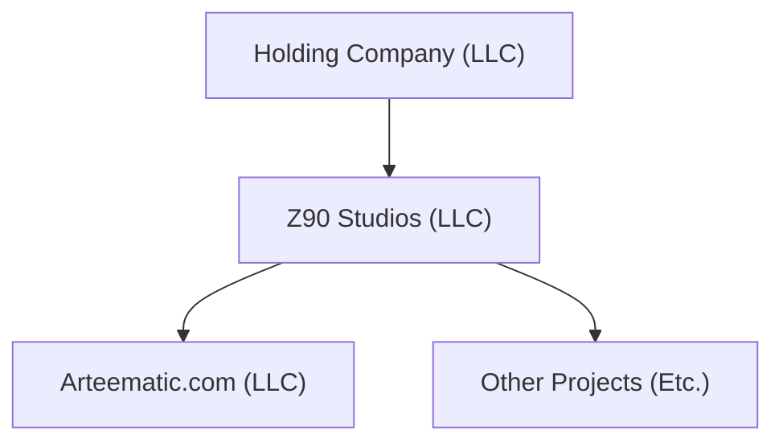
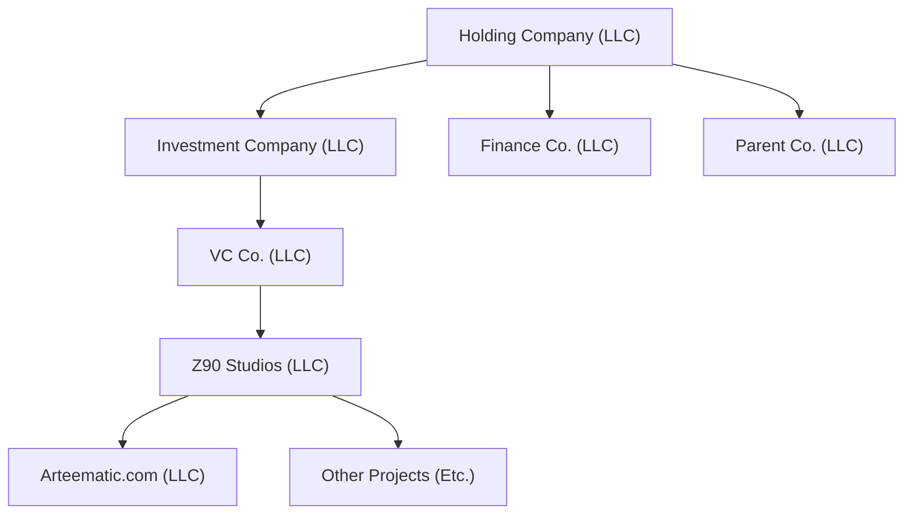
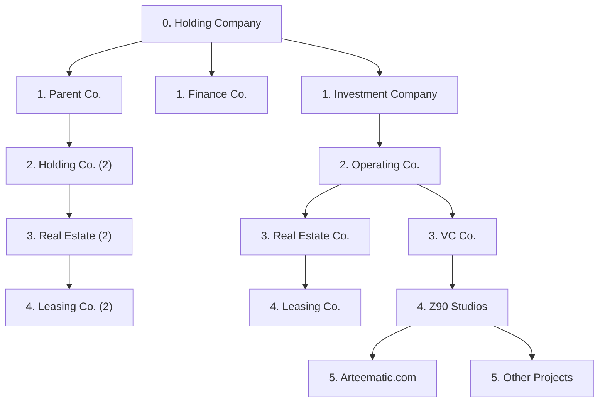

## Business Operations

This document will go over the basics on business operations, following this basic bullet point list below:

- Create a holding company that has nothing to do with me personally (e.g. Magic 8 Ball Holding)
- Since it is a holding company, it can only own shares
- Then make the LLC for whatever I'm trynna do, owned by the holding company
- The more nested the holding companies are, the better
- The purpose for this is to remove liability and add extra steps just in case

### Initital Setup

- Setup the holding company with the Wyoming Law Firm
	- Search the terms Real Estate
	- ("Digital Real Estate")

### Timeline

---

## Beta Setup

Name | Description
---- | ----
Holding Company | To remove liability from me, anonymous based in Wyoming. Only owns shares in other companies.
Investment Company | To shelter any risks the VC company could face by sponsoring, or etc.
VC Co. | Actually owns shares in the companies that make the money.
Finance Co. | Accountant & Law Firm for the Holding Company
Parent Co. | Operating Company. These are the ones that handle operations within this structure.

---

## Sigma Setup

Name | Description
---- | ----
Holding Company | To remove liability from me, anonymous based in Wyoming. Only owns shares in other companies.
Investment Company | To shelter any risks the VC company could face by sponsoring, or etc.
VC Co. | Actually owns shares in the companies that make the money.
Finance Co. | Accountant & Law Firm for the Holding Company
Parent Co. | Operating Company. These are the ones that handle operations within thin this structure.

When you buy the property, the leasing co you have has no direct connection to the actual property owner.

---