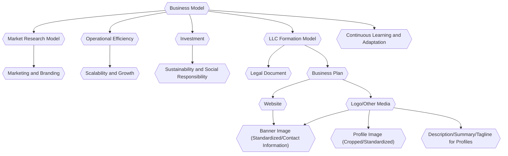

import Details from "@w/Details.astro"





<br />

<Details data="Business Model Tasks">

- [ ] - Business Model Generation

</Details>

<Details data="Business Model Data">

### Business Model Data

```json


```

```sql


```

</Details>

### Business Model Notes

Creating a business model for an AI agent involves considering the unique capabilities and needs of AI technology, as well as addressing market demands and potential competitors.
Below is a simplified business model for an AI-based personal productivity assistant named "ProdBot."

- `Value Proposition` - "ProdBot helps professionals and students enhance their productivity by smartly organizing their tasks, suggesting optimal times for breaks and work, and integrating seamlessly with other digital tools."
- `Customer Segments` - 
- - Professionals with busy schedules.
- - Students looking for study aids.
- - Small businesses seeking organizational tools.
- `Channels` -
- - Direct online sales through the ProdBot website.
- - Partnerships with productivity-related websites and apps.
- - Affiliate marketing through influencers focused on productivity.
- `Customer Relationships` -
- - Automated customer service and FAQs.
- - Human-augmented support for complex issues.
- - Community forums for users to share tips and tricks.
- `Revenue Streams` -
- - Monthly/Annual subscriptions for premium features.
- - Freemium model where basic functionalities are free, but advanced features come with a cost.
- - Licensing the AI tech to other productivity tool companies.
- `Key Resources` -
- - Proprietary AI algorithms.
- - Cloud infrastructure for data storage and processing.
- - Product development and customer support teams.
- `Key Activities` -
- - Continuous improvement of the AI model based on user data.
- - Marketing and partnership outreach.
- - User experience (UX) optimization.
- `Key Partnerships` -
- - Productivity bloggers and vloggers for promotions.
- - Tech companies for integration opportunities (e.g., calendar apps, task managers, etc.)
- - Cloud service providers for infrastructure needs.
- `Cost Structure` -
- - Cloud hosting and data storage costs.
- - R&D for AI model improvements.
- - Marketing and sales expenses.
- - Personnel salaries and benefits.
- `Unique Selling Points (USPs)` -
- - Personalized productivity insights based on individual user behavior.
- - Seamless integration with other popular digital tools.
- - Constant learning and improvement of suggestions based on user feedback.

#### Potential Challenges

- `Data Privacy Concerns` : 
- - Ensuring user data is stored and processed securely is paramount. ProdBot should be GDPR compliant and transparent about data usage policies.

- `Competition` :
- - The productivity tool market is crowded. ProdBot must consistently innovate and provide unique value to users.

- `Scalability` :
- - As the user base grows, so does the need for processing power and storage. An efficient, scalable infrastructure is essential.

##### Next Steps:

- 1. Prototype Development
- 2. Beta Testing with a small group of users
- 3. Iterative improvement based on feedback
- 4. Full launch and marketing push

This business model is a foundation. As with all ventures, continuous adaptation to real-world feedback and changing market conditions is key to long-term success.