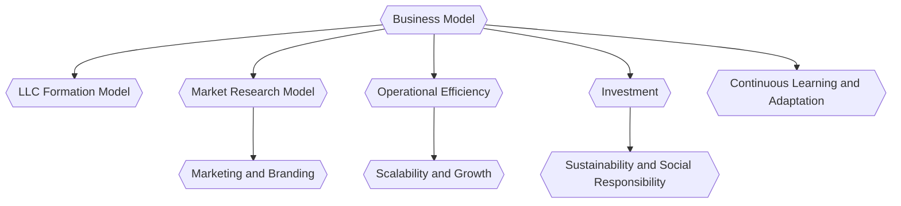

import Details from "@w/Details.astro"





<br />

<Details data="Business Model Tasks">

- [ ] - Business Model Generation

</Details>

<Details data="Business Model Data">

### Business Model Data

```json


```

```sql


```

</Details>