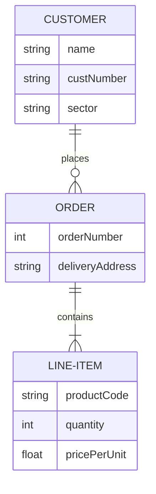

### Integration Break Down

#### Understanding the diverse needs of startups

This part emphasizes that startups have a variety of needs. 
Startups come in different shapes, sizes, industries, and have various business models. 
Their requirements might range from marketing tools to inventory management or even collaboration software.
Recognizing these diverse needs means that the solution being discussed (in this case, the AI) is designed to cater to a wide range of different startup necessities.

#### The AI offers seamless integration with existing business tools and platforms

This suggests that the AI in question isn't trying to replace every tool a startup already uses.
Instead, it's designed to easily integrate or work alongside these existing tools.
This could mean that it can pull data from other software, enhance the capabilities of current tools, or work in tandem with them without causing disruptions.

#### This ensures a cohesive and user-friendly experience

The primary goal of the AI's integration capabilities is to create a unified experience for the user.
By integrating seamlessly with existing tools, users don't have to switch back and forth between multiple platforms.
It's all interconnected, creating a smoother workflow. When tools work together without hitches, it usually leads to a more straightforward, intuitive user experience.

##### Integration Tool Summary

This AI system understands that every startup is unique and has its own specific needs.
Instead of making startups change their current tools, the AI can easily connect and work with those tools.
As a result, users get a smooth and easy-to-use experience.