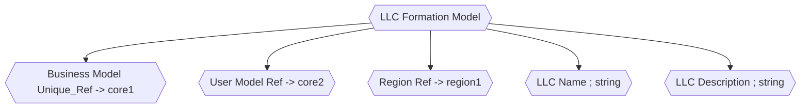

```mermaid
graph

layer1{{"LLC Formation Model"}}

lid0{{"Business Model Unique_Ref -> core1"}}
lid1{{"User Model Ref -> core2"}}
lid2{{"Region Ref -> region1"}}
lid3{{"LLC Name ; string"}}
lid4{{"LLC Description ; string"}}

layer1 --> lid0
layer1 --> lid1
layer1 --> lid2
layer1 --> lid3
layer1 --> lid4

```

