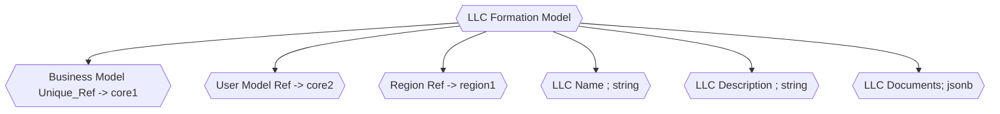

### LLC Formation Model Notes

- In the modern digital era, the process of forming a Limited Liability Company (LLC) can be streamlined using machine learning (ML).
- An ML-based software solution for LLC formation can:

- - `Data Collection` :  Gather required information from users through smart forms that predict and pre-fill fields based on user input patterns and regional norms.
- - `Document Review and Preparation` : Automate the creation of articles of organization and other necessary documents, ensuring accuracy and adherence to regional requirements using trained models.
- - `Regulatory Compliance` : Utilize predictive models to stay updated with evolving state-specific regulations and requirements, offering users guidance on ensuring their LLC remains compliant.
- - `Recommendations` : Based on historical data and user profiles, recommend optimal LLC structures, banking services, or insurance products tailored to the specific needs of the business.
- - `Monitoring` : Continuously monitor the business environment and provide alerts to LLC owners about relevant changes in legislation or other pertinent factors.
- - `Feedback Loop` : Incorporate user feedback and data from successful LLC formations to refine and enhance the predictive accuracy and efficiency of the system.

In essence, leveraging machine learning in the domain of LLC formation can expedite the setup process, reduce errors, ensure compliance, and offer tailored recommendations, making the overall experience more efficient and user-friendly for budding entrepreneurs.

### Legal Document Collection

#### Terms of Service Document

#### Privacy Document

#### Disclaimer Document

#### EULA Document

#### Operational Document

##### By-Law Document

#### Non-Disclosure Agreement Document