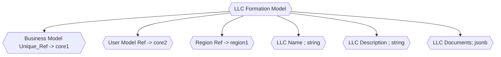

### LLC Formation Model Notes

    - In the modern digital era, the process of forming a Limited Liability Company (LLC) can be streamlined using machine learning (ML).

    - An ML-based software solution for LLC formation can:
        - `Data Collection` :
            - Gather required information from users through smart forms that predict and pre-fill fields based on user input patterns and regional norms.
        - `Document Review and Preparation` :
            - Automate the creation of articles of organization and other necessary documents, ensuring accuracy and adherence to regional requirements using trained models.
        - `Regulatory Compliance` :
            - Utilize predictive models to stay updated with evolving state-specific regulations and requirements, offering users guidance on ensuring their LLC remains compliant.
        - `Recommendations` :
            - Based on historical data and user profiles, recommend optimal LLC structures, banking services, or insurance products tailored to the specific needs of the business.
        - `Monitoring` :
            - Continuously monitor the business environment and provide alerts to LLC owners about relevant changes in legislation or other pertinent factors.
        - `Feedback Loop` :
            - Incorporate user feedback and data from successful LLC formations to refine and enhance the predictive accuracy and efficiency of the system.

    In essence, leveraging machine learning in the domain of LLC formation can expedite the setup process, reduce errors, ensure compliance, and offer tailored recommendations, making the overall experience more efficient and user-friendly for budding entrepreneurs.

    ### Legal Document Collection

        - `Document Metadata` : Each document can have metadata attributes such as:
            - `Document type` : (e.g., contract, will, deposition, etc.)
            - `Date created`
            - `Last modified date`
            - `Lawyer/Paralegal assigned`
            - `Client information`
            - `Case number/reference`
            - `Status (draft, finalized, etc.)`

        - `File Storage` :
            - [Appwrite](/application/appwrite/#storage) offers storage functionality where you can store, retrieve, and manage the actual document files (like PDFs, DOCX, etc.)

        - `Document Versioning` :
            - Given that legal documents can be revised multiple times, you can maintain versions of each document.
            - Appwrite's storage can be used for this purpose.
            - You could use a naming convention or metadata to distinguish between different versions.

        - `Notifications and Communication` :
            - Use Appwrite's functions (which can act like serverless functions) to integrate with third-party notification services.
            - This could be used to notify a lawyer when a document has been edited or reviewed by a client, etc.

        - `Search Functionality` :
            - Given the vast number of documents that a law firm might manage, it's crucial to have an efficient search mechanism.
            - While Appwrite doesn't provide an out-of-the-box search engine, you can use its database querying capabilities and potentially integrate with other search solutions for more advanced searching and indexing.

        - `Security and Compliance` :
            - Encryption: Ensure documents are encrypted at rest and in transit.
            - Regular Backups: Establish regular backup mechanisms, especially given the sensitivity and importance of legal documents.
            - Audit Trails: Maintain logs of who accessed or modified documents, especially for compliance and security reasons.

        - `APIs and Integration`:
            - Appwrite provides APIs to manage collections, which means you can integrate the document system with other tools the law firm might be using, like case management systems or billing platforms.

        - `UI/UX` :
            - While Appwrite provides the backend capabilities, you'd need to build a frontend tailored to the needs of the law firm's staff and potentially its clients.

        - `Access from Multiple Devices` :
            - Since lawyers and paralegals might need access from different devices, ensure that the frontend is responsive and can work on mobile devices and tablets.

        Remember that while Appwrite provides a lot of capabilities, the specific requirements of a law firm and the intricacies of managing legal documents might necessitate custom solutions and integrations.
        Always prioritize security, privacy, and compliance in every architectural and design decision.

#### Terms of Service Document

Building a terms of service (ToS) documentation generator using Appwrite would involve combining your legal knowledge (or that of your colleagues) with the technical tools provided by Appwrite.

Appwrite provides a set of backend services that you can utilize to store, manage, and retrieve data for your application.
In the case of a ToS documentation generator, you can use Appwrite to store templates of legal documents and then populate those templates with data provided by users to create custom ToS documents.

##### ToS Outline

1. Setup Appwrite:

    - Install Appwrite on your server if it's not already set up.
    - Follow the official documentation for the installation guide located [here](/application/appwrite/#install).

2. Create a Project in Appwrite:

    - Once installed, you'd create a new project within Appwrite.
    - This project would be dedicated to your ToS generator application.

3. ToS Template Storage:

    - Design a collection in Appwrite for storing various legal templates.
    - This collection can have fields like templateName, content, placeholders, etc.

4. API for Template Management:

    - You'd probably want to have CRUD (Create, Read, Update, Delete) operations available for these templates.
    - Use Appwrite's built-in features to provide these endpoints.

5. User Interface:
    
    - Create a user-friendly interface where the user can:
    - Select the type of ToS they need.
    - Provide any required information to fill into the template (e.g., company name, jurisdiction, etc.).
    - Generate the ToS based on their selections and inputs.
    - This could be a web-based application or a desktop application, depending on your firm's needs.

6. Generating the ToS:

    - When the user provides all the necessary information and selects a ToS template:
    - Retrieve the chosen template from Appwrite.
    - Replace all the placeholders in the template with the provided data.
    - Return the generated document to the user, either for download or via email.

7. Additional Features:

    - `Document History` : 
        - Using Appwrite's storage, you can also keep a versioned history of generated documents if needed.
    - `User Accounts` : 
        - Using Appwrite's built-in user management, you can let users create accounts, allowing them to save their information for faster document generation in the future or to track their past generated documents.
    - `Notifications` : 
        - Appwrite provides functionalities for sending out email notifications.
        - You could use this feature to notify users about updates to templates or to deliver their generated documents.

8. Security and Privacy:

    - Given that you're dealing with legal documents, ensuring security and privacy should be a top concern. Make sure data at rest and in transit is encrypted.
    - You might also want to consider allowing users to delete their generated ToS if they are stored, to meet various data privacy regulations.

9. Regular Template Updates:
    
    - Legal requirements change over time.
    - Ensure that there's a procedure in place to regularly review and update the ToS templates.

10. Testing & Deployment
    
    - Before deploying, ensure that you rigorously test the application for both functionality and security vulnerabilities.
    - Once everything is ready and thoroughly tested, deploy your application to a production environment.

This is a high-level overview, and the actual implementation might require a deeper understanding of your firm's specific needs and the intricacies of legal document generation.
However, this should give you a good starting point on how to approach this problem using Appwrite.

#### Privacy Document

We would follow the same layout and concept for the ToS but have it shift towards focusing on privacy.

#### Disclaimer Document

Similar to the ToS and Privacy documentation, we would just shift the data over towards `disclaimer`.

#### EULA Document

The EULA would be an extension of various softwares that they would be using, a bit of a collection of multiple different EULAs as well. 
Thus also similar to the ToS, Privacy and Disclaimer.

#### Operational Document

The scope for the operational document would have to be different because if its a Single LLC verse a multi-person LLC.

Reference for Operational Documents
- [eForms](https://eforms.com/operating-agreements/)

##### By-Law Document

Generating bylaws for an LLC using machine learning is a complex task, as bylaws are legal documents with specific clauses and provisions that require careful construction to ensure they are valid and enforceable.
Nonetheless, a high-level approach to this problem would involve the following steps:

1. Data Collection:
    - Gather as many LLC bylaws as possible. The more diverse and comprehensive your dataset, the better.
    - Note: Ensure you have the legal rights to access and use this data.
    - Process and clean the data to remove any personal or confidential information.

2. Data Preprocessing: 
    - Tokenize the bylaws.
    - Breaking down the bylaws into sentences or smaller chunks can make the training process smoother.
    - Ensure consistent formatting and structure across all documents. This might involve removing headers/footers, page numbers, etc.

3. Choose a Model Architecture:
    - For text generation tasks, models like RNNs, LSTMs, and Transformers (like GPT-2 or GPT-3) have proven to be successful.
    - If using a transformer-based model, you might consider fine-tuning an existing pre-trained model on your bylaws dataset.

4. Training:
    - Feed your processed data into the chosen model.
    - Depending on the model and dataset size, this step might require significant computational power.
    - Monitor metrics like loss and, if possible, some form of qualitative evaluation to ensure the generated bylaws make sense.

5. Evaluation:
    - After training, you need to evaluate the generated bylaws.
    - Ideally, involve legal professionals in this step.
    - They can assess the quality, consistency, and legality of the generated documents.
    - Use feedback to refine and retrain the model as necessary.

6. Deployment:
    - Once you're satisfied with the model's performance, develop an interface or application where users can input specific parameters or requirements for their LLC, and the model generates appropriate bylaws.

7. Post-deployment Monitoring:
    - Regularly check the generated bylaws to ensure they remain consistent with legal standards, especially if laws change over time.
    - It's advisable to always have a legal professional review any machine-generated bylaws before they are finalized to avoid potential legal issues.

8. Limitations & Ethical Considerations:
    - A machine learning model is only as good as the data it's trained on. Ensure you are not perpetuating any biases or problematic practices from your dataset.
    - Always be transparent with users about the origin and potential limitations of the generated bylaws. Include disclaimers recommending professional legal review before use.
    - Consider potential privacy implications when gathering and using datasets.

#### Non-Disclosure Agreement Document

This would be similar to how we form the By-Laws, there would be a bulk amount of data for the NDA templates, then generates the NDA based upon user input.