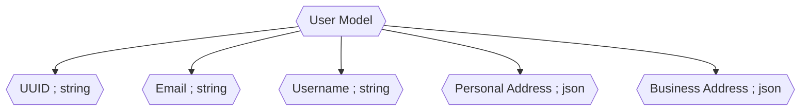

import Details from "@w/Details.astro"



<br />

<Details data="User Model Tasks">

- [ ] - User Model Generation
- [ ] - User Register with Captcha Protection
- [ ] - Payment Management
- [ ] - Email Recovery and Authentication

</Details>

<Details data="Member Model extending User->Appwrite in Python">

### Example of Member Model

`Member->User->Appwrite`

```python

class Member:
    def __init__(self, user_id, name, registration, status, email, email_verification, password_update, preferences, roles):
        self.id = user_id  # unique identifier
        self.name = name  # name of the user
        self.registration = registration  # registration timestamp
        self.status = status  # account status
        self.email = email  # email address
        self.email_verification = email_verification  # email verification status
        self.password_update = password_update  # last password update timestamp
        self.preferences = preferences  # user preferences
        self.roles = roles  # user roles

    def is_active(self):
        return self.status == 1

    def is_email_verified(self):
        return self.email_verification

    def has_role(self, role):
        return role in self.roles

    # You can add more methods to interact with the Member object

```

</Details>

### Member Model Extends User Object

Appwrite is a development platform that provides back-end services for web and mobile developers.
One of its core features is the user management system.
The User object in Appwrite represents an individual user of an application.

### User Object

- See [Appwrite Notes for the User Object](/application/appwrite/#appwrite-user)


