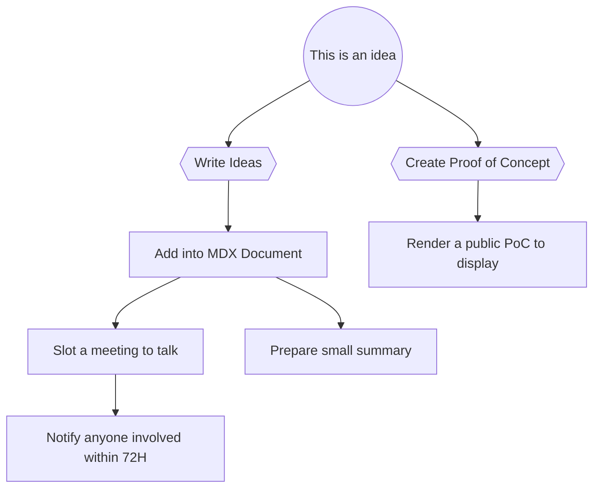
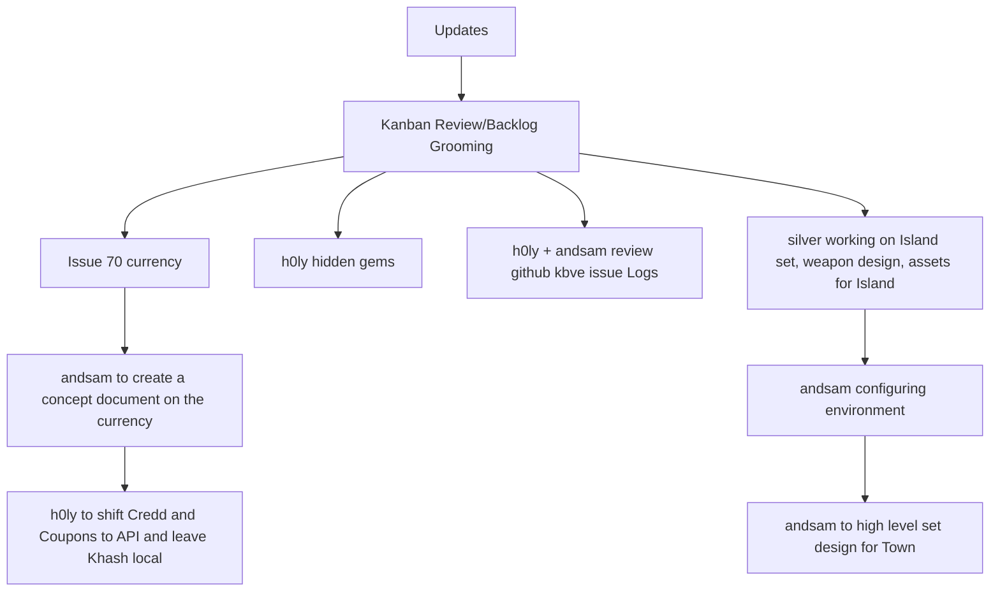
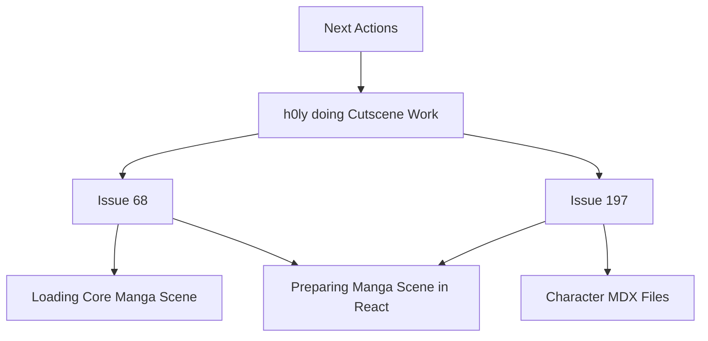

import Details from '@w/Details.astro';

## Information

We are currently testing for the Steam Demo release.

We definitely think the dark and darker style but set in the cyberpunk future is the best way to describe the path the game will take.

---

## Notes

### Ideas

- Get Unity Assets for Robots NPC Bosses etc `low poly`
- Add more levels to the game
- Creating Levels - need ideas what kinda of levels and what assets to use
- Borderlands is the TO-GO game
- Improving AI - adding new state machines to the game so enemies are more interesting
- Boss Fights
- Game is in space We use Space SkyBox
- Leveling Up System - MAX HP increases when player levels up
- Talent Tree - TBD
- Upgrade System - Upgrade Weapons
- New Weapons Added
- New Classes Added - Each class got unique ability
- SFX GunShots - `NO BGX`
- Original Ticket for the Theme Song Idea https://github.com/KBVE/kbve.com/issues/43

### Log

- [ ] h0lybyte: Integrate the React with Unity
- [ ] Added + 2 more levels(total levels 4)
- [ ] Enemy Ai Improved
- [ ] Upgrade System
- [ ] Boss Fight
- [ ] When player drops down he doesent die. Game needs to reset.
- [ ] Re-design Menu so responsive for more platforms
- [ ] Move Gameplay Actions into Button for android usage
- [ ] Displaying Stats in the game panel (TBD)
- [ ] Inventory System
- [ ] When player dies he loses items that he bring with him
- [ ] Main Menu Inventory(player select what items to bring for the next level)
- [ ] Inventory data values stored in JSON
- [ ] New VFX for weapons
- [ ] InventoryDisplaying in Menu
- [ ] Steam Integration [Git Issue](https://github.com/KBVE/kbve.com/issues/366)

- [x] User Interface all the values are displayed on the screen or in the menu
- [x] Main Menu (Modern Menu Designed)much more fun to interact with!
- [x] LoginSceneDesign
- [x] MainSceneDesign
- [x] InGameMenu design and functionality
- [x] Scaling UI in game for all devices
- [x] Level SelectionScene and Functionality
- [x] SceneFlow
- [x] Player Level Up System(max level TBD)
- [x] HP Getting Upgraded on Level
- [x] Added Currency inside game(killed enemies drop currency)
- [x] Currency is saved trought out scene
- [x] ~Create `Concept` Issue Ticket~
- [x] ~RogueJester - (init) - Start the initialization of RogueJester~
- [x] ~Map out the ideas~
- [x] Update SkyBox

---

### Journal

Collective thoughts, concepts and ideas for the RogueJester FPS.

---

#### J13

06-26-2023

@h0lybyte wants to organize the notes a bit more.
The goal would be to make the notes a bit easier to read and flow.
@ziggy added Mermaid, which I believe we should use moving forward with our notes.

Updated the Project file for RogueJester

#### J12

RogueJester CheckIn 6-26-2023

-> Updates:

Kanban Review/Backlog Grooming : https://github.com/orgs/KBVE/projects/3/views/5

Issue 70 currency : https://github.com/KBVE/roguejester/issues/70 andsam to create a concept document on the currency Khash,Credd,Coupon

h0ly to shift Credd and Coupons to API and leave Khash local

h0ly hidden gems : https://www.humblebundle.com/software/unity-hidden-gems-software

-> Next Actions
-> h0ly doing Cutscene Work
-> https://github.com/KBVE/roguejester/issues/68
-> https://github.com/KBVE/roguejester/issues/197

-> h0ly + andsam review github kbve issue Logs
-> silver working on Island set, weapon design, assets for Island

-> andsam configuring environment -> andsam to high level set design for Town

Next Action

---
---
---

### Archive

We will migrate older journal entries into here below.

#### J11

##### 06-23-2023

RogueJester CheckIn 6-23-2023

-> Updates:

> > Humanoid Animations and Aiming has been fixed -silver
> > Turret and Customization for Assets -silver

> > Town Generation Work to be scheduled -andsam
> > High Level Roadmap In Progress, Ready for 6/23 -andsam

> > Review of Humble Bundle Unity Verified Hidden Gems -bell
> > -> Discussion Topics
> > Level and Set Design Meeting scheduled for next RogueJester Meeting 6-26
> > -> Next Actions:
> > Decision on Humble Pack
> > https://www.humblebundle.com/software/unity-hidden-gems-software

New Scheduling Set Up

#### J10

##### 06-19-2023

RogueJester CheckIn 6-19-2023
-> Previous Updates:

> > Github LFS Resolved, Using Unity Plastic SCM to handle Build Maintenance. via h0ly + Silver
> > Town Generation Work via Silver

-> Discussion Topics
-> Town +Island Scene Combination
--> proposal of town/scene combination is aligned to open-world concept
--> assets within each sub-scene would be appropriate these sections
--> Conclusion Is: Faraway sub-island with town/city assets on it will be created, and will remain to create the illusion of faraway city for the player in the Island Scene

-> Night Scene - Tutorial
--> Gives the player an opportunity to acclimate to the game and its controls.

-> HumbleBundle Assets
-> Lowpoly's elapsed on 6/16 WOMP WOMP :
https://animpic-studio.art/
-> Eldamar Assets will be loaded in later today / tomorrow
-> Unity Hidden Gems ends 6/29
-> https://www.humblebundle.com/software/unity-hidden-gems-software

-> Writing Direction
-> Discussion Pending

#### J9

##### 06-10-2023

Older Entry has not been found saved within the cloud.

#### J8

##### 05-10-2023

Older Entry has not been found saved within the cloud.

#### J7

#### 12-10-2022

We decided to remove almost all of the Unity MicroFPS codebase and introduced Opsive controller / inventory system.

The reason we decided to switch over is because it will speed up development and resolve some of the cosmetic / physics / animation / logic issues that we are currently facing.

I believe majority of this week will be spent on focusing on integrating both Opsive plugins into the game. Thus all of Patch 1.2.x will be towards getting everything for the player done.

So we were working on the pipeline, durning the development hell that is Unity, and ran into a "Build" success but a "Build and Run" failure.

We spent some time re-merging the base, switching branches, thinking it might be a cluster of different issues.
Silver comes in clutch and finds out that there was a `duplicate on GameManager Prefab Replacer , 2 of the same script on same object`.

#### J6

##### 05-10-2023

Older Entry has not been found saved within the cloud.

#### J5

##### 11-15-2022

- Had an issue with the basing earlier in the day. We will split the branches further, to avoid conflicts and issues when rebasing / merging branches.
- When migrating from the public to private repo, there were some issues with `secrets` and CI/CD, these issues are still open and should be resolved this week.

##### 11/14/2022

- Improving the UI/UX
- Expanding Character Stats

#### J4

##### 11-11-2022

Older Entry has not been found saved within the cloud.

  

#### J3

##### 11-13-2022

- Start expanding the assets inside the game and work with some core logic.
- ZaneRage and h0lybyte did the basics the idea / concept.
- New asset models for the 3D robot soldiers.
- Added several more assets to the game!

#### J2

##### 11-12-2022

Older Entry has not been found saved within the cloud.

#### J1

##### 11-11-2022

Older Entry has not been found saved within the cloud.

#### J0

##### 11-01-2022

- Ideas How to Convert 1. System.Text.Json namespace to convert C# objects to JSON and vice-versa.
- Explained in this [link](https://www.tutorialsteacher.com/articles/convert-object-to-json-in-csharp#:~:text=The.NET%205%20framework%20provides%20the%20built-in%20JsonSerializer%20class,built-in%20JsonSerializer%20class%20that%20converts%20objects%20to%20JSON)
- Thus, convert the JSON string to class object in C# using the `JsonSerializer.Deserialize () method`.

---

## Assets

List of Assets and Plugins that we are using inside of the RJ Project.

- [SteamWorks](https://kbve.com/application/unity/)
- [SkyBox](https://kbve.com/application/unity/#skybox) || [Direct Asset Link](https://assetstore.unity.com/packages/2d/textures-materials/sky/skybox-volume-2-nebula-3392)
- [UCC](https://kbve.com/application/unity/#ucc)
- [Gaia](https://kbve.com/application/unity/#gaia)
- [3D Robot Soldier](https://assetstore.unity.com/packages/3d/characters/robots/robot-soldier-142438)
- [UAV Trident](https://assetstore.unity.com/packages/3d/vehicles/space/uav-trident-46128)
- [Combat Drone](https://assetstore.unity.com/packages/3d/low-poly-combat-drone-82234)
- [Spider Orange](https://assetstore.unity.com/packages/3d/characters/robots/spider-orange-181154)
- [Robot Metallic Humanoid](https://assetstore.unity.com/packages/3d/characters/robots/robot-metallic-humanoid-171295)
- [Sentry 3D Robot](https://assetstore.unity.com/packages/3d/characters/robots/sentry-robot-222899)
- [Robot 3D Sphere](https://assetstore.unity.com/packages/3d/characters/robots/robot-sphere-136226)

---

## REF

- Quick [Search](https://assetstore.unity.com/?category=3d%2Fcharacters%2Frobots&free=true&orderBy=1) on the Unity Assets page for FREE\* 3D Characters -> Robots

---
