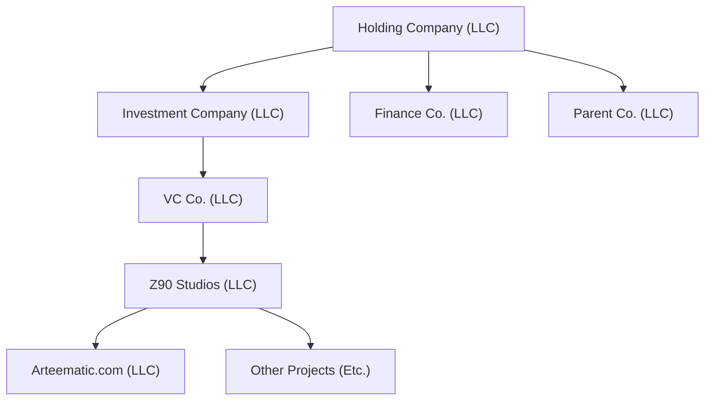

Name | Description
---- | ----
Holding Company | To remove liability from me, anonymous based in Wyoming. Only owns shares in other companies.
Investment Company | To shelter any risks the VC company could face by sponsoring, or etc.
VC Co. | Actually owns shares in the companies that make the money.
Finance Co. | Accountant & Law Firm for the Holding Company
Parent Co. | Operating Company. These are the ones that handle operations within this structure.
