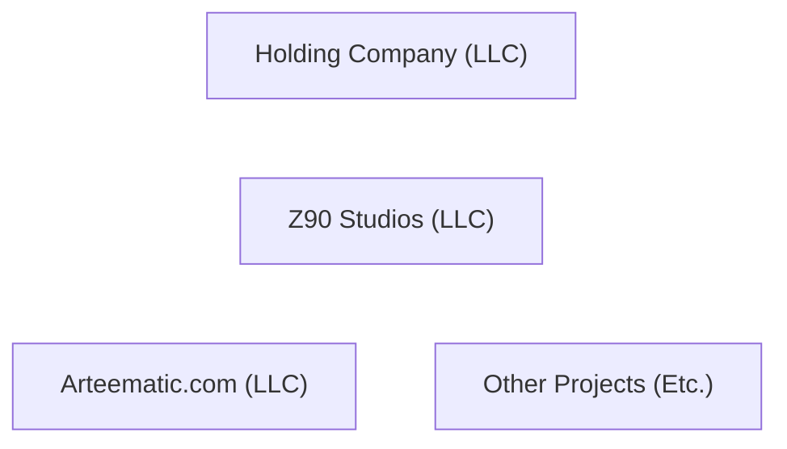

### Initital Setup

```mermaid
graph TD

A["Holding Company (LLC)"] --> B["Z90 Studios (LLC)"]
B --> C["Arteematic.com (LLC)"]
B --> D["Other Projects (Etc.)"]

linkStyle default stroke:white
```
- Setup the holding company with the Wyoming Law Firm
	- Search the terms Real Estate
	- ("Digital Real Estate")