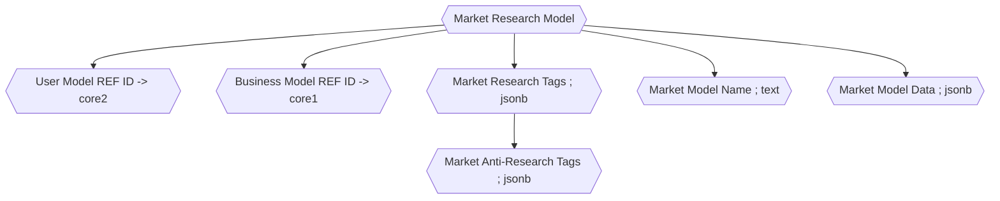

import Details from "@w/Details.astro"




<br />

<Details data="Market Research Model Tasks">

- [ ] - Market Research Model Generation
- [ ] - Relationship of Market Research Model and User Model
- [ ] - Relationship of Market Research Model and Business Model
- [ ] - Collapse Tags and Anti Tags into Data Blog? Or keep Isolated?

</Details>

<Details data="Market Research Model Data">

### Market Research Model Data

```sql

create table
  market_research_model (
    id bigint generated by default as identity primary key,
    inserted_at timestamp with time zone default timezone ('utc'::text, now()) not null,
    updated_at timestamp with time zone default timezone ('utc'::text, now()) not null,
    tags jsonb,
    anti_tags jsonb,
    name text,
    auth_id uuid,
    constraint market_research_model_auth_id_fkey foreign key (auth_id) references auth.users (id)
  );


alter table market_research_model
  enable row level security;

create policy "Users can select their own market research model." on market_research_model
  for select using (auth.uid() = auth_id);

create policy "Users can insert their own market research model." on market_research_model
  for insert with check (auth.uid() = auth_id);

create policy "Users can update their own market research model." on market_research_model
  for update using (auth.uid() = auth_id);

```

</Details>