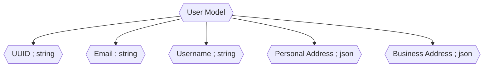

import Details from "@w/Details.astro"

```mermaid
graph

core2{{"User Model"}}

uid0{{"UUID ; string"}}
uid1{{"Email ; string"}}
uid2{{"Username ; string"}}
uid3{{"Personal Address ; json"}}
uid4{{"Business Address ; json"}}

core2 --> uid0
core2 --> uid1
core2 --> uid2
core2 --> uid3
core2 --> uid4

```

 

- [ ] - User Model Generation
- [ ] - Payment Management
- [ ] - Email Recovery and Authentication

